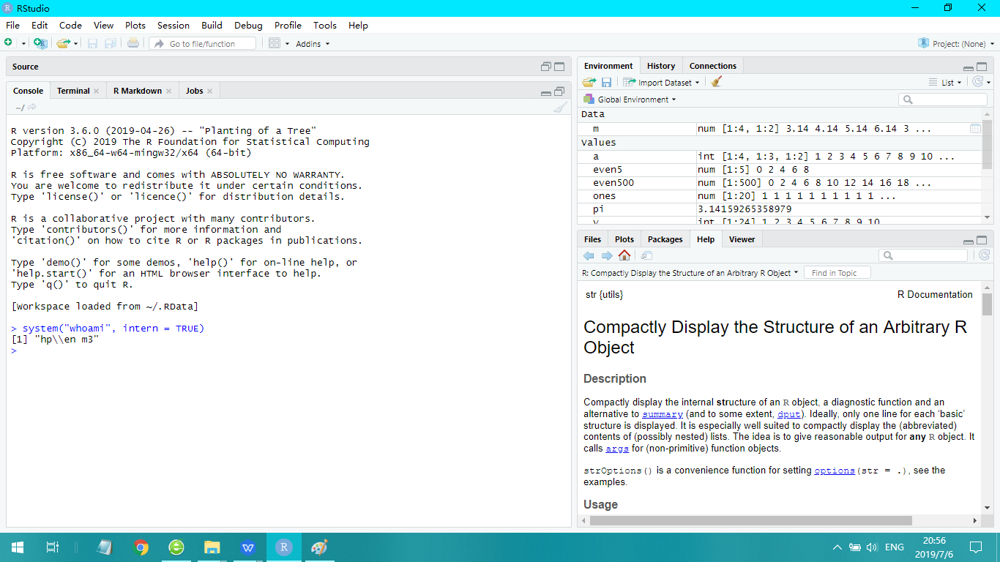

```{r setup, include=FALSE}
knitr::opts_chunk$set(echo = TRUE)
```

## 1. Installing R & RStudio

### 1.1 Proof of Installation

```{r}
system("whoami", intern = TRUE)
```

Here is the screen capture of the console window of RStudio:




## 2. Installing Packages and Loading them using library()

I have installed the packages using the function install.packages(), the input to this function each time is the name of the package to be installed.
When loading a package, the function being used is library(), where the input is the name of the package.

### 2.1 Proof of Installation of the packages

```{r}
find.package("tidyverse")
```

```{r}
find.package("readr")
```

```{r}
find.package("foreign")
```


## 3. Application of Basic R Rules

### 3.1 Working with Vectors and some vector math

#### A. Converting 79 degrees Fahrenheit to Celsius

```{r}
(79-32)*5/9
```

#### B. Converting the values in nhtemp to celsius

```{r}
v <- as.numeric(nhtemp)
(v-32)*5/9
```

### 3.2 Character (String) and Logical Vectors

#### A. Creating a character vector

```{r}
chv <- c("wrath", "avarice", "sloth", "pride", "lust", "envy", "gluttony")
chv
```

#### B. Printing the last two elements

```{r}
chv[6:7]
```

#### C. Answer to the question

The reason is that b only consists of the values are TRUE and FALSE, and these values are also numeric data: TRUE is 1 and FALSE is 0, hence b + 3 did not result in an error. However, d has character data: "Harvard", "MIT", and "Stanford", and character data is not numeric data, so d + 3 results in an error.
 
### 3.3 Matrices

#### A. 3 ways to create the matrix

```{r}
v <- 49:20
m <- matrix(v, ncol=5, byrow=TRUE)
m
```

```{r}
c1 <- seq(from=49, by=-5, length.out=6)
c2 <- seq(from=48, by=-5, length.out=6)
c3 <- seq(from=47, by=-5, length.out=6)
c4 <- seq(from=46, by=-5, length.out=6)
c5 <- seq(from=45, by=-5, length.out=6)
m <- cbind(c1, c2, c3, c4, c5)
m
```

```{r}
r1 <- 49:45
r2 <- 44:40
r3 <- 39:35
r4 <- 34:30
r5 <- 29:25
r6 <- 24:20
m <- rbind(r1, r2, r3, r4, r5, r6)
m
```


#### B. Display the values in the 3rd row only.

```{r}
m[3,]
```

#### C. Display the values in 2nd and 4th columns only

```{r}
matrix(c(m[,2],m[,4]), nrow=6)
```

### 3.4 Data Frames

#### A. Choose a data frame

The data frame I choose is PlantGrowth.

#### B. Proof of selecting an appropriate dataset

```{r}
class(PlantGrowth)
```

```{r}
mode(PlantGrowth)
```

#### C. How many observations and variables does the data frame have?

```{r}
str(PlantGrowth, list.len = 0)
```
The outputs imply that there are 30 observations of 2 variables.

#### D. Extracting from USArrests

##### i. The data for California:

```{r}
USArrests["California",]
```

##### ii. All of the values for UrbanPop:

```{r}
USArrests$UrbanPop
```

##### iii. All of the variables for the state with the lowest murder rate:

```{r}
subset(USArrests, Murder==min(USArrests$Murder))
```

##### iv. Only those observations with a minimum UrbanPop of 85 or higher:

```{r}
subset(USArrests, UrbanPop>=85)
```


## 4. Putting it all together: Writing Functions

### A. Writing Pseudocode

#### ·Input temperature in Fahrenheit
#### ·check that temperature in Fahrenheit is numeric
#### ·temperature in Celsius <- ((temperature in Fahrenheit)-32)*5/9

#### ·Output temperature in Celsius

### B. Implementing your pseudocode

```{r}
Fah2Cel <- function(f){
  if (!is.numeric(f)) 
    stop("please input a numeric vector")
  c <- (f-32)*5/9
  return(c)
}
```
