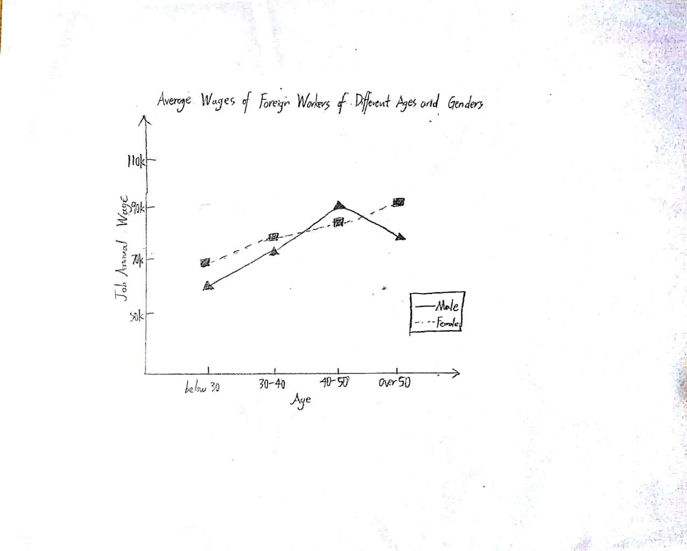

```{r setup, include=FALSE}
knitr::opts_chunk$set(echo = TRUE)
```


## 1. The Visualization

These are the steps of setup and reading data:

```{r}
library(readr)
library(dplyr)
PERM2018 <- read_csv("PERM2018.csv")
dim(PERM2018)
```

There are 117645 observations of 125 variables in PERM2018.

Then, I want analyze the average payments of the foreign employees whose nationalities are Indian, Chinese, or the others. The analysis will compare the average payments of employees with different education backgrounds, and the denied cases versus the certified cases. The visualization will show that whether there is a difference between the employees from India or China and the others in their overall payments.

Firstly, the data is filtered to count the number of observations with PW_UNIT_OF_PAY_9089 as "Year", in order to determine whether this variable is always "Year" for all observations:

```{r}
dim(PERM2018[PERM2018$PW_UNIT_OF_PAY_9089=="Year", 1:125])
```

Since all observations have PW_UNIT_OF_PAY_9089=="Year", we can know that all numbers in the column PW_AMOUNT_9089 are annual payments of the jobs. Therefore, these numbers can be analyzed and compared directly without further modifications.

Here are the generation of filtered and augmented data frames. 

```{r}
nat_in <- PERM2018[PERM2018$COUNTRY_OF_CITIZENSHIP=="INDIA" & (PERM2018$FOREIGN_WORKER_INFO_EDUCATION=="Master's"|PERM2018$FOREIGN_WORKER_INFO_EDUCATION=="Bachelor's"|PERM2018$FOREIGN_WORKER_INFO_EDUCATION=="Doctorate")&(PERM2018$CASE_STATUS=="Certified-Expired"|PERM2018$CASE_STATUS=="Certified"),c("CASE_STATUS","PW_AMOUNT_9089","FOREIGN_WORKER_INFO_EDUCATION")]
nat_ch <- PERM2018[PERM2018$COUNTRY_OF_CITIZENSHIP=="CHINA" & (PERM2018$FOREIGN_WORKER_INFO_EDUCATION=="Master's"|PERM2018$FOREIGN_WORKER_INFO_EDUCATION=="Bachelor's"|PERM2018$FOREIGN_WORKER_INFO_EDUCATION=="Doctorate")&(PERM2018$CASE_STATUS=="Certified-Expired"|PERM2018$CASE_STATUS=="Certified"),c("CASE_STATUS","PW_AMOUNT_9089","FOREIGN_WORKER_INFO_EDUCATION")]
nat_others <- PERM2018[PERM2018$COUNTRY_OF_CITIZENSHIP!="CHINA"&PERM2018$COUNTRY_OF_CITIZENSHIP!="INDIA" & (PERM2018$FOREIGN_WORKER_INFO_EDUCATION=="Master's"|PERM2018$FOREIGN_WORKER_INFO_EDUCATION=="Bachelor's"|PERM2018$FOREIGN_WORKER_INFO_EDUCATION=="Doctorate")&(PERM2018$CASE_STATUS=="Certified-Expired"|PERM2018$CASE_STATUS=="Certified"),c("CASE_STATUS","PW_AMOUNT_9089","FOREIGN_WORKER_INFO_EDUCATION")]

nat_in_denied <- PERM2018[PERM2018$COUNTRY_OF_CITIZENSHIP=="INDIA" & (PERM2018$FOREIGN_WORKER_INFO_EDUCATION=="Master's"|PERM2018$FOREIGN_WORKER_INFO_EDUCATION=="Bachelor's"|PERM2018$FOREIGN_WORKER_INFO_EDUCATION=="Doctorate")&PERM2018$CASE_STATUS=="Denied",c("CASE_STATUS","PW_AMOUNT_9089","FOREIGN_WORKER_INFO_EDUCATION")]
nat_ch_denied <- PERM2018[PERM2018$COUNTRY_OF_CITIZENSHIP=="CHINA" & (PERM2018$FOREIGN_WORKER_INFO_EDUCATION=="Master's"|PERM2018$FOREIGN_WORKER_INFO_EDUCATION=="Bachelor's"|PERM2018$FOREIGN_WORKER_INFO_EDUCATION=="Doctorate")&PERM2018$CASE_STATUS=="Denied",c("CASE_STATUS","PW_AMOUNT_9089","FOREIGN_WORKER_INFO_EDUCATION")]
nat_others_denied <- PERM2018[PERM2018$COUNTRY_OF_CITIZENSHIP!="CHINA"&PERM2018$COUNTRY_OF_CITIZENSHIP!="INDIA" & (PERM2018$FOREIGN_WORKER_INFO_EDUCATION=="Master's"|PERM2018$FOREIGN_WORKER_INFO_EDUCATION=="Bachelor's"|PERM2018$FOREIGN_WORKER_INFO_EDUCATION=="Doctorate")&PERM2018$CASE_STATUS=="Denied",c("CASE_STATUS","PW_AMOUNT_9089","FOREIGN_WORKER_INFO_EDUCATION")]

```

Here is the calculations of the mean values of wages:

```{r}
mean_in_b=mean(nat_in[nat_in$FOREIGN_WORKER_INFO_EDUCATION=="Bachelor's",c("CASE_STATUS","PW_AMOUNT_9089","FOREIGN_WORKER_INFO_EDUCATION")]$PW_AMOUNT_9089,na.rm=TRUE)
mean_in_m=mean(nat_in[nat_in$FOREIGN_WORKER_INFO_EDUCATION=="Master's",c("CASE_STATUS","PW_AMOUNT_9089","FOREIGN_WORKER_INFO_EDUCATION")]$PW_AMOUNT_9089,na.rm=TRUE)
mean_in_d=mean(nat_in[nat_in$FOREIGN_WORKER_INFO_EDUCATION=="Doctorate",c("CASE_STATUS","PW_AMOUNT_9089","FOREIGN_WORKER_INFO_EDUCATION")]$PW_AMOUNT_9089,na.rm=TRUE)

mean_ch_b=mean(nat_ch[nat_ch$FOREIGN_WORKER_INFO_EDUCATION=="Bachelor's",c("CASE_STATUS","PW_AMOUNT_9089","FOREIGN_WORKER_INFO_EDUCATION")]$PW_AMOUNT_9089,na.rm=TRUE)
mean_ch_m=mean(nat_ch[nat_ch$FOREIGN_WORKER_INFO_EDUCATION=="Master's",c("CASE_STATUS","PW_AMOUNT_9089","FOREIGN_WORKER_INFO_EDUCATION")]$PW_AMOUNT_9089,na.rm=TRUE)
mean_ch_d=mean(nat_ch[nat_ch$FOREIGN_WORKER_INFO_EDUCATION=="Doctorate",c("CASE_STATUS","PW_AMOUNT_9089","FOREIGN_WORKER_INFO_EDUCATION")]$PW_AMOUNT_9089,na.rm=TRUE)

mean_others_b=mean(nat_others[nat_others$FOREIGN_WORKER_INFO_EDUCATION=="Bachelor's",c("CASE_STATUS","PW_AMOUNT_9089","FOREIGN_WORKER_INFO_EDUCATION")]$PW_AMOUNT_9089,na.rm=TRUE)
mean_others_m=mean(nat_others[nat_others$FOREIGN_WORKER_INFO_EDUCATION=="Master's",c("CASE_STATUS","PW_AMOUNT_9089","FOREIGN_WORKER_INFO_EDUCATION")]$PW_AMOUNT_9089,na.rm=TRUE)
mean_others_d=mean(nat_others[nat_others$FOREIGN_WORKER_INFO_EDUCATION=="Doctorate",c("CASE_STATUS","PW_AMOUNT_9089","FOREIGN_WORKER_INFO_EDUCATION")]$PW_AMOUNT_9089,na.rm=TRUE)


mean_in_b_denied=mean(nat_in_denied[nat_in_denied$FOREIGN_WORKER_INFO_EDUCATION=="Bachelor's",c("CASE_STATUS","PW_AMOUNT_9089","FOREIGN_WORKER_INFO_EDUCATION")]$PW_AMOUNT_9089,na.rm=TRUE)
mean_in_m_denied=mean(nat_in_denied[nat_in_denied$FOREIGN_WORKER_INFO_EDUCATION=="Master's",c("CASE_STATUS","PW_AMOUNT_9089","FOREIGN_WORKER_INFO_EDUCATION")]$PW_AMOUNT_9089,na.rm=TRUE)
mean_in_d_denied=mean(nat_in_denied[nat_in_denied$FOREIGN_WORKER_INFO_EDUCATION=="Doctorate",c("CASE_STATUS","PW_AMOUNT_9089","FOREIGN_WORKER_INFO_EDUCATION")]$PW_AMOUNT_9089,na.rm=TRUE)

mean_ch_b_denied=mean(nat_ch_denied[nat_ch_denied$FOREIGN_WORKER_INFO_EDUCATION=="Bachelor's",c("CASE_STATUS","PW_AMOUNT_9089","FOREIGN_WORKER_INFO_EDUCATION")]$PW_AMOUNT_9089,na.rm=TRUE)
mean_ch_m_denied=mean(nat_ch_denied[nat_ch_denied$FOREIGN_WORKER_INFO_EDUCATION=="Master's",c("CASE_STATUS","PW_AMOUNT_9089","FOREIGN_WORKER_INFO_EDUCATION")]$PW_AMOUNT_9089,na.rm=TRUE)
mean_ch_d_denied=mean(nat_ch_denied[nat_ch_denied$FOREIGN_WORKER_INFO_EDUCATION=="Doctorate",c("CASE_STATUS","PW_AMOUNT_9089","FOREIGN_WORKER_INFO_EDUCATION")]$PW_AMOUNT_9089,na.rm=TRUE)

mean_others_b_denied=mean(nat_others_denied[nat_others_denied$FOREIGN_WORKER_INFO_EDUCATION=="Bachelor's",c("CASE_STATUS","PW_AMOUNT_9089","FOREIGN_WORKER_INFO_EDUCATION")]$PW_AMOUNT_9089,na.rm=TRUE)
mean_others_m_denied=mean(nat_others_denied[nat_others_denied$FOREIGN_WORKER_INFO_EDUCATION=="Master's",c("CASE_STATUS","PW_AMOUNT_9089","FOREIGN_WORKER_INFO_EDUCATION")]$PW_AMOUNT_9089,na.rm=TRUE)
mean_others_d_denied=mean(nat_others_denied[nat_others_denied$FOREIGN_WORKER_INFO_EDUCATION=="Doctorate",c("CASE_STATUS","PW_AMOUNT_9089","FOREIGN_WORKER_INFO_EDUCATION")]$PW_AMOUNT_9089,na.rm=TRUE)

```


### Here is the final plot:

```{r,fig.width=8,fig.height=5}
#boxplot(nat_ch$PW_AMOUNT_9089 ~ nat_ch$FOREIGN_WORKER_INFO_EDUCATION)
plot(c(1,2,3),type="b",c(mean_in_b,mean_in_m,mean_in_d),xaxt = "n", xlab='Highest Education Achieved by the Foreign Workers',col="green",pch=19, ylab="Annual Job Wages",ylim=c(55000,105000),yaxt = "n",main="Average Job Wages of Foreign Workers based on Countries of Citizenship")
lines(c(1,2,3), c(mean_ch_b,mean_ch_m,mean_ch_d), pch=15, col="red", type="b")
lines(c(1,2,3), c(mean_others_b,mean_others_m,mean_others_d), pch=17, col="blue", type="b")
lines(c(1,2,3), c(mean_in_b_denied,mean_in_m_denied,mean_in_d_denied), pch=1, col="green", type="b", lty=2)
lines(c(1,2,3), c(mean_ch_b_denied,mean_ch_m_denied,mean_ch_d_denied), pch=0, col="red", type="b", lty=2)
lines(c(1,2,3), c(mean_others_b_denied,mean_others_m_denied,mean_others_d_denied), pch=2, col="blue", type="b", lty=2)
axis(1, at=1:3, labels=c("Bachelor's","Master's","Doctorate"))
axis(2, at=seq(60000, 100000, 10000), labels=c("60k","70k","80k","90k","100k"))

legend(2.35, 73000, legend=c("China, certified", "China, denied", "Inida, certified", "Inida, denied", "others, certified", "others, denied"),
       col=c("red", "red", "green", "green", "blue", "blue"),lty=1:2, cex=0.75)

```

The three colors, red, green, blue, corresponds to the three kinds of countries of citizenship of employees: China, India, and the others. The dashed lines indicate data of denied cases, while the solid lines indicate data of certified cases(including expired ones).


## 2. The Brief Write-Up

### Introduction:

There are 117645 observations of 125 variables in PERM2018.The dataset is a collection of the data of employers' Applications for Permanent Employment Certifications from October 1, 2017 to September 30, 2018. The data include relative complete information about the cases' process and results, the employers, the jobs, and the employees. I am trying to display the difference among the foreign workers with 3 groups of countries of citizenship: China, India, and other countries, given the fact that India and China are two major hometowns of foreign workers. For each group, I display how job payments vary according to educational backgrounds, andhow job payments differ between certified cases and denied cases. My hypothesis is that with the same educational background, employees whose countries of citizenship are India or China have higher average wages than the others; employees with higher degrees have higher average wages than the employees with lower degrees; for each group of countries of citizenship, there is no obvious differences between the avergae wage of the certified cases and that of the denied cases.

### Methodology:

My visualization involved the variables CASE_STATUS, PW_AMOUNT_908, COUNTRY_OF_CITIZENSHIP, and FOREIGN_WORKER_INFO_EDUCATION of the dataset because I only need these variables for this visualization. The rest variables are not interesting in this case. When processing data, I created smaller new data frames by filtering so that each new dataset contains only the necessary columns of the obesrvations of one specific group of countries of citizenship and one specific case status. Then, I calculated the means of job wages of each new dataset and generated the plot. I choose to make a plot with both points and lines because it will make the visualization clear. For example, if only points are used, the plot would be harder to read because there are 6 types of dots, and some dots are very close to each other. The plot has width 8 and height 5 because with this size, the visualization can appear normally on a reasonably sized screen with each label clear. The scaling of y-axis is 55000 to 105000, because this range is sufficient to hold all points and lines as well as the legend. There are three color used in this plot: red indicating the data of employees whose countrie of citizenship is China, green indicating the data of employees whose countrie of citizenship is Inida, and blue indicating the data of all other foreign employees. The lines connecting data of ceritified cases are solid, while the lines connecting data of denied cases are dashed. The plotting symbols for certified data are solid, while the plotting symbols for denied data are hollow, but for each color their shapes are the same.

### Conclusion:

The result supports the first part of my hypothesis, which is that with the same educational background, employees whose countries of citizenship are India or China have higher average wages than the others. However, it does not support the other parts of my hypothesis. The visualization tells us that employees with higher degrees may not higher average wages than the employees with lower degrees, and with the same group of countries of citizenship and the same educational background, the certified cases have higher average wages than the denied cases.


## 3. The Open-Ended Questions

### A.

I would add the column of the birth year of the employees and the column of genders of the employees. These two columns can be named as "FOREIGN_WORKER_INFO_GENDER" and "YEAR_OF_BIRTH". "FOREIGN_WORKER_INFO_GENDER" would contain only two values, "Male", "Female", while "YEAR_OF_BIRTH" would contain numerical data of the birth years of all workers. I think this data should be obtained when  the employers submit applications, otherwise this data is very hard to obtain later.

### B.

Suppose I really had these two additional columns of data, I would be able to answer the additional questions: 

Does the male foreign employees have higher average wages than the female foreign employees?

Is their an association between the age of the foreign employees and the case certification rate?

Both of these two questions could not be answered with the original data.

### C.

Here is the sketch of the new visualization:


